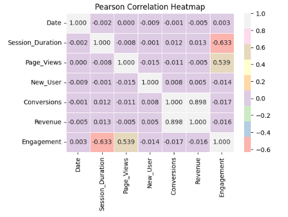
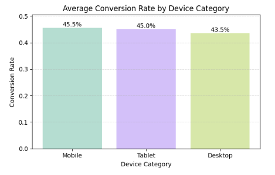

# Web Marketing Campaign Performance Analysis

## 1. Project Goals
This project analyzes session-level web marketing data to:
- Understand user engagement and conversion behavior across segments (user type, source/medium, campaign, device, and country).
- Identify which factors are associated with higher conversion efficiency and revenue outcomes.
- Provide actionable insights and recommendations for improving marketing performance

## 2. Data Source
CSV dataset hosted on GitHub (raw link used in the notebook): https://raw.githubusercontent.com/dinhhluu/Web-Marketing-Campaign-Performance-Analysis/main/web_marketing_data.csv

## 3. Data Overview
The dataset contains **10,000 session-level records** and multiple groups of variables capturing user behavior, marketing channels, and business outcomes.

**Key variables include:**

`Date`: The date of the user session (MM/DD/YYYY).

`User_ID`: A unique identifier for each user.

`Session_Duration`: The duration of the user’s session in seconds.

`Page_Views`: The number of pages viewed by the user during the session.

`Source`: The origin of the user’s traffic (e.g., Referral, Social, Direct, Organic).

`Medium`: The marketing medium used (e.g., Direct, Social Media, Organic Search, Referral). Note: “Referral” can appear in both Source and Medium, indicating different types of referrals. Source “Referral” implies the user came from another website, while Medium “Referral” suggests a referral link or campaign.

`Campaign`: The specific marketing campaign associated with the session (e.g., Spring Promo, Summer Sale, Winter Campaign). Blank values indicate sessions not directly linked to a specific campaign.

`Device_Category`: The type of device used by the user (e.g., Desktop, Mobile, Tablet).

`Country`: The user’s geographic location.

`New_User`: A binary indicator (1 for new user, 0 for returning user).

`Conversions`: The number of conversions attributed to the user during the session.

`Revenue`: The revenue generated from the user during the session (in USD).

**Engineered features**
- `Engagement = Page_Views / Session_Duration`
- `Conversion_Rate = Conversions / Page_Views`
- `Revenue_per_Conversion = Revenue / Conversions` (Conversions = 0 handled as NaN)
- `User_Type`: mapped from `New_User` (New vs Returning)
- `Converted`: binary label for modeling (`Conversions > 0`)

**Data Cleaning Summary**
- Converted data types using `convert_dtypes()` and parsed `Date` to datetime.
- Filled missing `Campaign` values with `Others`.

## 4. Tools and Technologies Applied
- **Python**
- **Pandas / NumPy**: data cleaning, feature engineering, aggregation
- **Matplotlib / Seaborn**: visualization (bar charts, histograms, heatmaps, boxplots)
- **Statsmodels**: OLS regression, Logistic regression (Logit)
- **Scipy**: Mann–Whitney U test
- **Scikit-learn**: train/test split for model evaluation

## 5. Key Insights Discovered
- **Conversions and Revenue are strongly correlated**, confirming conversions as the primary revenue driver.
### Conversion Drives Revenue

  

  
  
*Conversions show a strong positive correlation with revenue, confirming conversion volume as the primary revenue driver.*

- **Conversion rate differences across segments are modest** (source, medium, campaign, country, device), suggesting no single segment dominates conversion performance.
- 
### Segment-Level Conversion Differences Are Modest

  

*Conversion rates across devices are relatively similar, indicating limited segment-driven performance differences.*

- **New users show slightly higher conversion rate than returning users**, which may indicate stronger new-user incentives or weaker retention mechanisms.
- **Revenue per conversion is highly consistent** across countries and devices, implying revenue differences are more driven by conversion volume than transaction value.
- 
### Revenue per Conversion Is Stable Across Segments

  

*Transaction value remains consistent across countries, suggesting revenue differences are volume-driven.*
  
- Over time (weekly), **conversion rate is relatively stable** while **total revenue fluctuates more**, suggesting revenue changes may be volume/value-driven rather than conversion-rate driven.
- 
### Revenue Fluctuations Are Volume-Driven Over Time

    

  *Weekly revenue varies more than conversion rate, reinforcing the volume-driven revenue pattern.*

## 6. Hypotheses Based on the Insights
- Since revenue per conversion is similar across segments, **total revenue differences are likely driven by conversion volume** (traffic and number of converting sessions).
- The higher conversion rate among new users may indicate that **onboarding or first-time purchase incentives are stronger than retention offers**.
- Given weak segment differentiation, **conversion behavior may depend on factors not captured** (e.g., landing page quality, product category, pricing changes, user intent signals, traffic quality).

## 7. Recommendations Based on Analysis Results
- **Prioritize strategies that increase conversion volume** (traffic quality + conversion count) since revenue per conversion is stable across segments.
- Strengthen **retention and repeat-purchase mechanics** (personalized offers, loyalty benefits, remarketing) to improve returning-user performance.
- Investigate additional features/data to improve modeling power:
  - product/category, basket size, discount, landing page, geo granularity, time-of-day, referral details, and user history.
- For modeling, consider approaches beyond basic OLS/Logit:
  - non-linear models, interaction terms (e.g., Country × Source), or tree-based models, and evaluation metrics beyond accuracy (precision/recall, ROC-AUC) due to class imbalance.
**Note:** Regression results showed very low explanatory power (low R² / pseudo R²) and non-significant predictors, so conclusions from models are treated as exploratory rather than predictive.

## 8. Notebook
The full analysis, visualizations, and modeling process can be found in the Google Colab notebook: (https://colab.research.google.com/drive/1GaAsw57H5LAbCcfFu1p2zGFZ2erL6M2M?usp=sharing)

